# Mermaid Style Learning File

## 1. Basic Flowchart

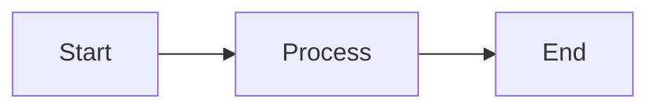

---

## 2. Fill and Stroke Colors

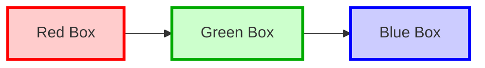

---

## 3. Dashed Connection

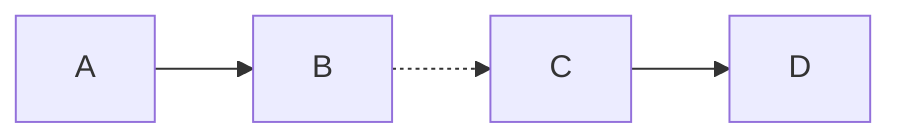

---

## 4. Thick Connection

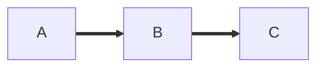

---

## 5. Text on Arrow

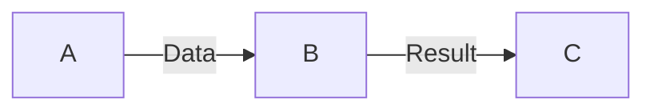

---

## 6. Bidirectional Arrow

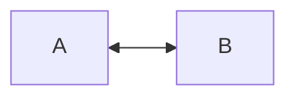

---

## 7. Different Node Shapes

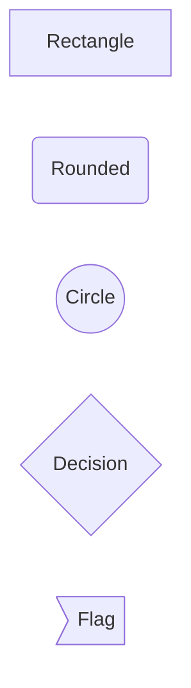

---

## 8. Subgraph Example

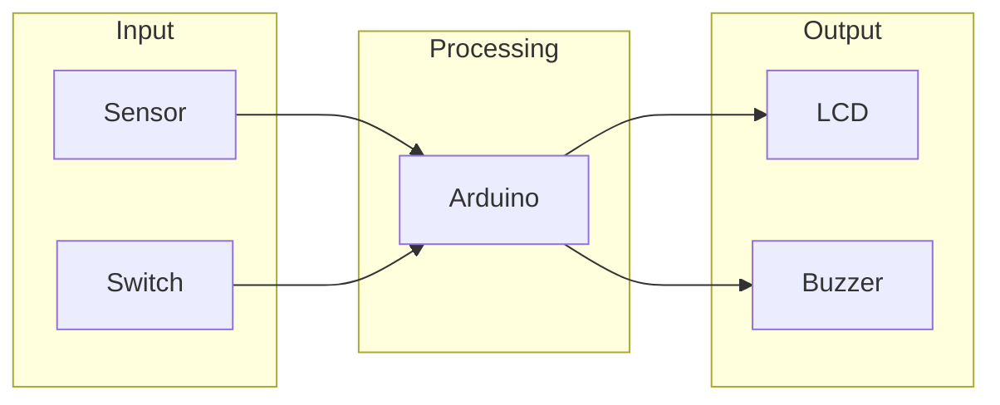

---

## 9. Class Definitions

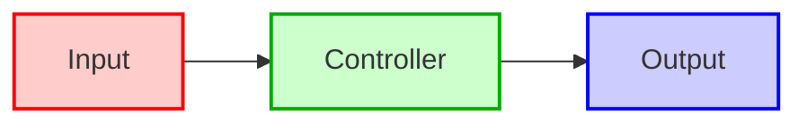

---

## 10. Dashed Border Node

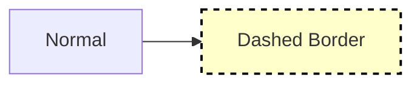

---

## 11. Multiple Arrow Types

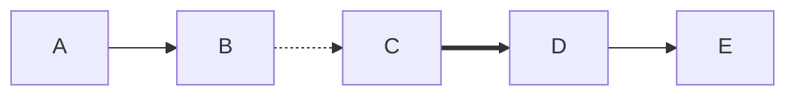

---

## 12. Sequence Diagram

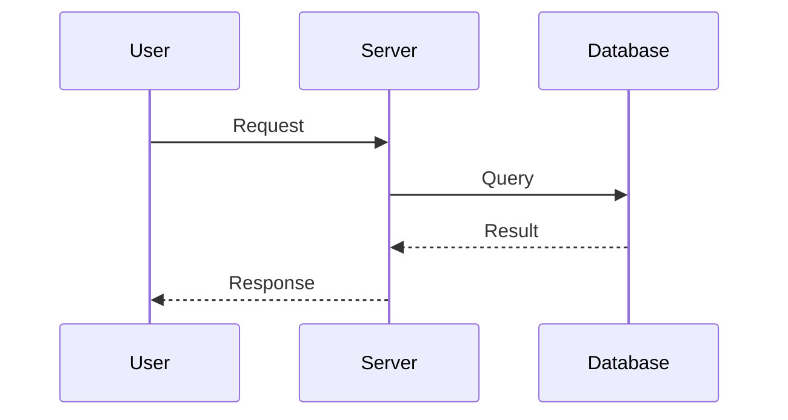

---

## 13. State Diagram

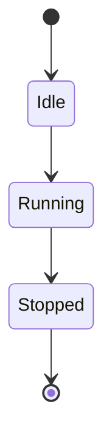

---

## 14. Gantt Chart

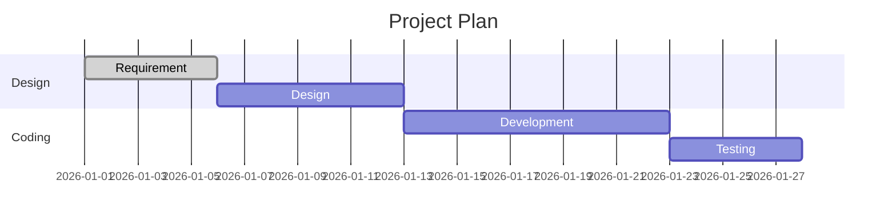

---

## 15. Pie Chart

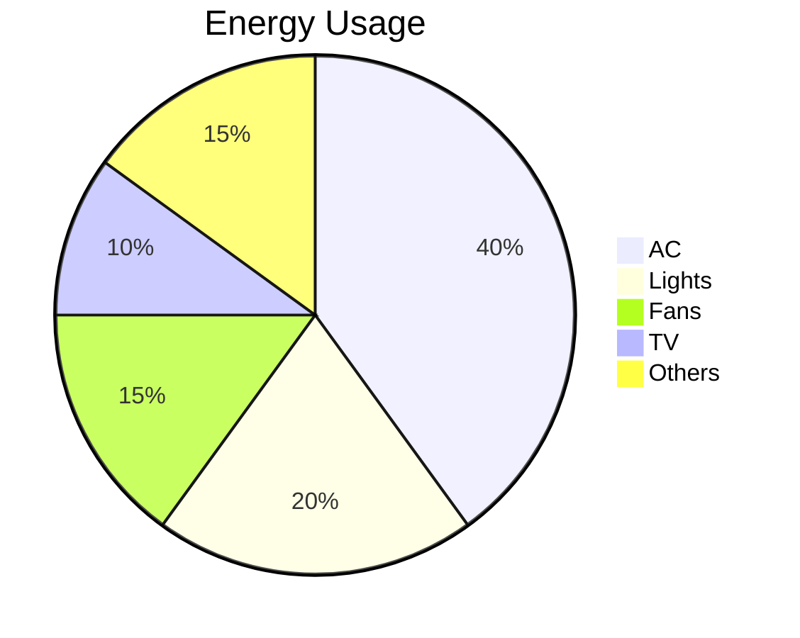

---

## 16. Arduino Energy Monitor Example

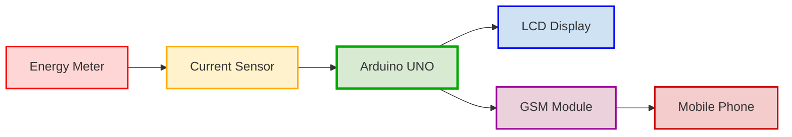

---

## 17. Dark Theme

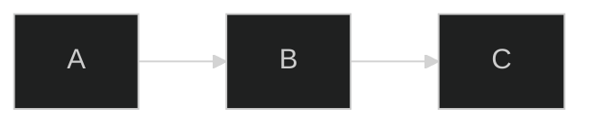

---

## 18. Forest Theme

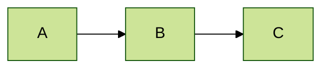

---

## 19. Neutral Theme

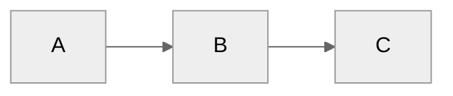

---

## 20. Large Combined Demo

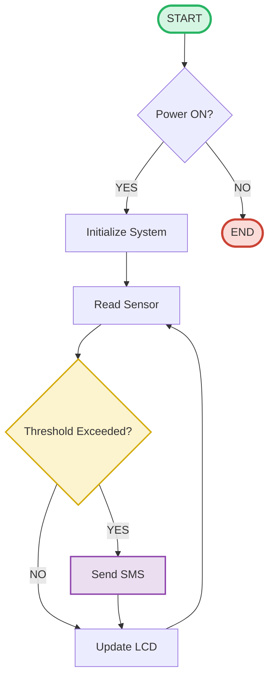